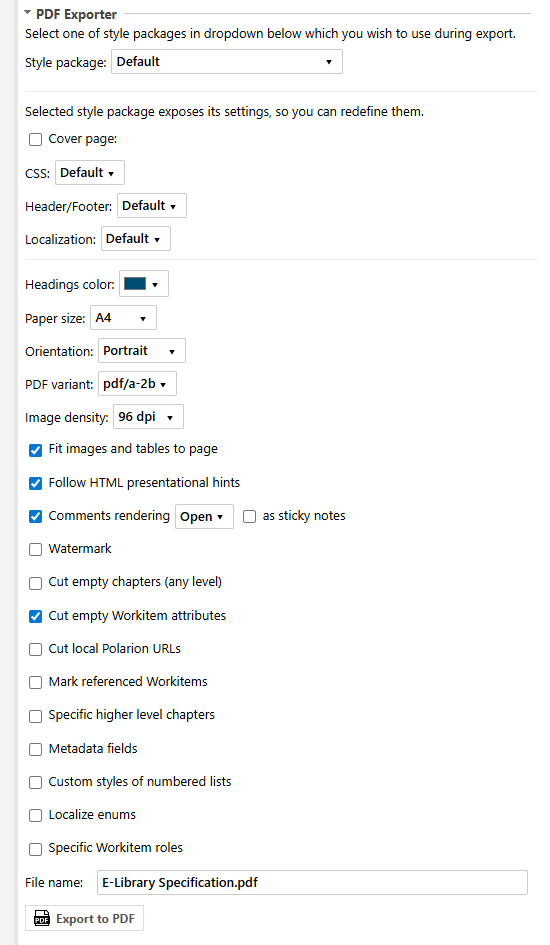
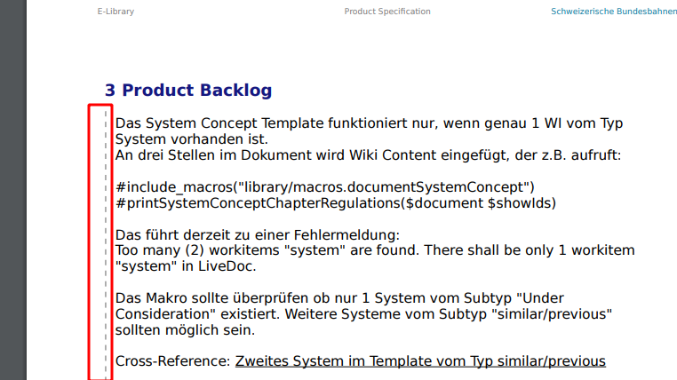

* [Export panel layout](#export-panel-layout)
* [Style packages](#style-packages)
* [Options](#options)
    * [Cover page](#cover-page)
    * [CSS](#css)
    * [Header and footer](#header-and-footer)
    * [Localization](#localization)
    * [Webhooks](#webhooks)
    * [Headers color](#headers-color)
    * [Paper size](#paper-size)
    * [Orientation](#orientation)
    * [Fit images and tables to page width](#fit-images-and-tables-to-page-width)
    * [Follow HTML presentational hints](#follow-html-presentational-hints)
    * [Comments rendering](#comments-rendering)
    * [Watermark](#watermark)
    * [Cut empty chapters](#cut-empty-chapters)
    * [Cut empty Workitem attributes](#cut-empty-workitem-attributes)
    * [Cut local Polarion URLs](#cut-local-polarion-urls)
    * [Mark referenced Workitems](#mark-referenced-workitems)
    * [Specific higher level chapters](#specific-higher-level-chapters)
    * [Custom styles of numbered lists](#custom-styles-of-numbered-lists)
    * [Localize enums](#localize-enums)
    * [Specific Workitem roles](#specific-workitem-roles)
    * [File name](#file-name)
    * [Download attachments](#download-attachments)
* [Bulk PDF Export](#bulk-pdf-export)

## Export panel layout
As the extension is installed and configured to appear on Document Properties pane, you can open any document in a project where you configured PDF exporter, open Document Properties sidebar and you will see following section added there:



If you use bulk export or button from the toolbar, Live Report or Test Run pages then modal popup appears with the same options but slightly different layout:


## Style packages
All exporter settings are combined into named style packages. Different packages can be configured different way as well as can hide their settings from being redefined by end user. In such a case you will be able only to select a package
to use without possibility to redefine its settings:


## Options
A package can also expose its options to be redefined by end user before exporting a document into PDF.

### Cover page
In first line of options pane there's a checkbox "Cover page", if ticked a dropdown will appear right hand side to select predefined cover page template to use during PDF generation:


### CSS
There can be different CSS settings created on admin pane each having its own name. You can chose which of them to use during PDF generation in second dropdown of options pane:


### Header and footer
Settings for header/footer of generated PDF document also grouped into named settings and can be chosen in next dropdown:


### Localization
The same relates to localization settings, which one to use during PDF generation can be selected in next dropdown:


### Webhooks
In this section you can choose specific webhook for custom HTML processing before sending it to WeasyPrint:


### Headers color
By default dark blue color (Polarion's default) is used for headers, but you can change this selecting any other color:


As a result headers of generated PDF will be of selected color:


### Paper size


This option specifies paper size of generated PDF document. Default is "A4".

### Orientation
This option serves as a document wide page orientation setting, either "Portrait" (default) or "Landscape". If you don't have page breaks in a document, then all pages in generated PDF file will have an orientation selected by you in this
dropbox. However you can insert a page break in document and override this document wide setting for certain pages (starting from page break and above till the beginning of document or till other page break). Page breaks can be inserted via
toolbar button:


And then you can specify custom orientation for this page break:


### Fit images and tables to page width
This option which is on by default tells PDF Exporter to fit images and tables into resulted page width even if their width in Polarion document exceed it.Elements exceed Polarion document width:


And fit into PDF document width after export:


### Follow HTML presentational hints
If you select this checkbox WeasyPrint will follow HTML presentational hints, i.e. if an HTML element has ```width``` attribute specified, it will be taken into account despite the fact that its usage is discouraged in favor of specifying
width via element's ```style``` attribute.

### Comments rendering
This option which is on by default tells PDF Exporter to include Polarion document's comments into generated PDF document (REMARK: please take into account that this relates only to LiveDoc comments, WorkItem comments regardless the fact
they look like LiveDoc comments **won't be displayed** in generated PDF under any circumstances).Following state of Polarion document:


Will result in following PDF:


If you though don't want comments to be included in generated PDF document - just un-check this checkbox.

### Watermark
If you select this checkbox all pages of resulted PDF document will include "Confidential" watermark:


### Cut empty chapters
If you select this checkbox empty chapters of any level will be excluded from being exported, like these selected in screenshot:


### Cut empty Workitem attributes
This option which is on by default tells PDF Exporter to exclude empty WorkItem attributes from resulted PDF document. Empty Workitem attribute in Polarion document (tabular representation):


Excluded from resulted PDF document:


Empty Workitem attribute in Polarion document (non-tabular representation):


Also excluded from resulted PDF document:


### Cut local Polarion URLs
If you select this checkbox all anchors which link to local Polarion resources will be cut off leaving only text they contain:


### Mark referenced Workitems
If you select this checkbox, referenced Workitems will have special styling (dashes left hand side):



### Specific higher level chapters
If you select this checkbox an input field will appear where you can specify which high-level chapters (as comma separated list of numbers) to be exported:


### Custom styles of numbered lists
If you select this checkbox an input field will appear where you can override default styles of numbered lists in-lined in text. Shortcuts are used for simplicity:

| Shortcut | Value of ```list-style-type``` CSS property | Result               |
|----------|---------------------------------------------|----------------------|
| 1        | decimal                                     | 1..<br>2..           |
| a        | lower-alpha                                 | a..<br>b..<br>c..    |
| i        | lower-roman                                 | i..<br>ii..<br>iii.. |
| A        | upper-alpha                                 | A..<br>B..<br>C..    |
| I        | upper-roman                                 | I..<br>II..<br>III.. |

Default styles are ```1ai```. You can enter any combination, eg. ```a1iAI```. Maximum depth of levels is 9. If you specify styles of less length, they will be repeated to form length of 9. For example if you enter 1ai resulted styles will
be ```1ai1ai1ai```.

### Localize enums
If you check this checkbox and select some non-English language from appeared dropbox:


Enumeration values which translations into specified language are provided in administration will be replaced by their translations in resulted PDF document.

Enumeration values in Polarion document:


As a result are replaced by their translations:


### Specific Workitem roles
If you check this checkbox and select only certain roles of Workitem relations:


...then among all possible Linked Workitems:


...will be taken only those which correspond selected roles (both direct and reverse directions):


And here is the resulted PDF document:


### File name
Here you can specify the resulting file name:


Note that the pre-generated value can be defined on the 'Filename' administration pane. In this section you can configure a schema for the generation of the used PDF-filename. Variables can be used as well. Each pane is designated for the
particular document type:


### Download attachments
Option available only for Test Runs:


By selecting this checkbox, you can set a mask for attachment file names that will be extracted from current Test Run and downloaded along with the regular PDF file.

## Bulk PDF Export
There is a possibility to export multiple documents in one run. This can be achieved with help of special widget:


Open a project where you wish do bulk export. Open its Default Space in Documents & Pages and create Live Report with name "Bulk PDF Export". Newly created report will be opened in edit mode. Change its title to "Bulk PDF Export" or whatever value you wish, then place cursor in a region you wish the widget to appear, choose "PDF Export" tag on "Widgets" sidebar on right hand side of the page, find "Bulk PDF Export" widget there and click it to add to the report. Then save a report clicking 💾 in a toolbar and then return to a view mode clicking "Back" button.

As a result you will see a table listing all Live Documents in a current project (with pagination). This widget is an extension of standard Polarion table with a data set and can be configured the similar way, for example you can specify a Lucene query to narrow list of displaying documents, change set of columns or modify soring rule:


When you are ready with filtering, sorting etc. of documents you can select multiple documents to be exported, ticking appropriate checkboxes and click Export to PDF button, a popup with export configuration will be opened. Select appropriate configuration and click Export button, new popup will be opened showing progress of exporting. When export is finished click Close button to hide popup. Also, you can click Stop button when export is in progress, in this case document which is exporting at the moment will finish and the rest which were pending will be cancelled.
