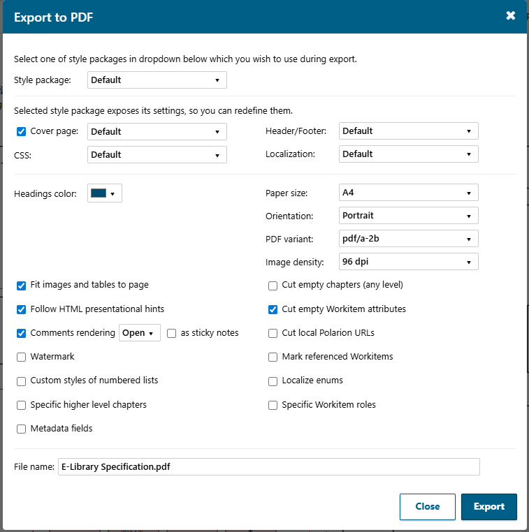
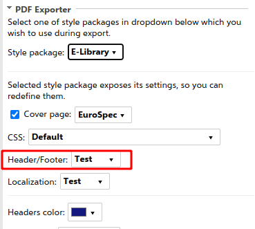
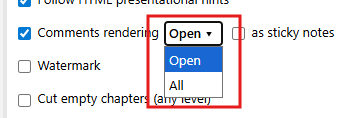
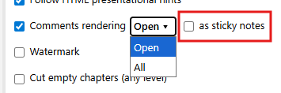

* [Export panel layout](#export-panel-layout)
* [Style packages](#style-packages)
* [Options](#options)
    * [Cover page](#cover-page)
    * [CSS](#css)
    * [Header and footer](#header-and-footer)
    * [Localization](#localization)
    * [Webhooks](#webhooks)
    * [Headings color](#headings-color)
    * [Paper size](#paper-size)
    * [Orientation](#orientation)
    * [PDF variant](#pdf-variant)
    * [Image density](#image-density)
    * [Fit images and tables to page width](#fit-images-and-tables-to-page-width)
    * [Follow HTML presentational hints](#follow-html-presentational-hints)
    * [Comments rendering](#comments-rendering)
    * [Watermark](#watermark)
    * [Cut empty chapters](#cut-empty-chapters)
    * [Cut empty Workitem attributes](#cut-empty-workitem-attributes)
    * [Cut local Polarion URLs](#cut-local-polarion-urls)
    * [Mark referenced Workitems](#mark-referenced-workitems)
    * [Specific higher level chapters](#specific-higher-level-chapters)
    * [Custom styles of numbered lists](#custom-styles-of-numbered-lists)
    * [Localize enums](#localize-enums)
    * [Specific Workitem roles](#specific-workitem-roles)
    * [Metadata fields](#metadata-fields)
    * [File name](#file-name)
    * [Download attachments](#download-attachments)
    * [Embed attachments into resulted PDF](#embed-attachments-into-resulted-pdf)
* [Bulk PDF Export](#bulk-pdf-export)

## Export panel layout
As the extension is installed and configured to appear on Document Properties pane, you can open any document in a project where you configured PDF exporter, open Document Properties sidebar and you will see following section added there:


If you use bulk export or button from the toolbar, Live Report or Test Run pages then modal popup appears with the same options but slightly different layout:



## Style packages
All exporter settings are combined into named style packages. Different packages can be configured in different ways and can also hide their settings from being redefined by the end user. In such cases you will be able only to select a package to use without the possibility to redefine its settings:


## Options
A package can also expose its options to be redefined by the end user before exporting a document into PDF.

### Cover page
In the first line of options pane there is a checkbox "Cover page". If ticked, a dropdown will appear on the right-hand side to select the predefined cover page template to use during PDF generation:


### CSS
There can be different CSS settings created on admin pane each having its own name. You can choose which of them to use during PDF generation in the second dropdown of options pane:


### Header and footer
Settings for header/footer of generated PDF document are also grouped into named settings and can be chosen in next dropdown:



### Localization
The same relates to localization settings. The one to use during PDF generation can be selected in the next dropdown:


### Webhooks
In this section, you can choose a specific webhook for custom HTML processing before sending it to WeasyPrint:


### Headings color
By default, dark blue color (Polarion's default) is used for headings, but you can change this by selecting any other color:


As a result, the headings of the generated PDF will be of selected color:


### Paper size
This option specifies the paper size of the generated PDF document. Default is "A4".

### Orientation
This option serves as a document-wide page orientation setting, either "Portrait" (default) or "Landscape". If you don't have page breaks in a document, then all pages in generated PDF file will have an orientation selected by you in this dropdown. However you can insert a page break in document and override this document-wide setting for certain pages (starting from page break and above till the beginning of document or till other page break). Page breaks can be inserted via the toolbar button:


And then you can specify custom orientation for this page break:


### PDF variant

This configuration property allows selecting a PDF variant to be used for PDF generation. The following variants are supported:

| Variant      | Description                                                      | Notes |
|--------------|------------------------------------------------------------------|-------|
| **pdf/a-1a** | Accessible PDF/A-1 (tagged, Unicode)                             | |
| **pdf/a-1b** | Basic visual preservation (older PDF standard)                   | |
| **pdf/a-2a** | Accessible PDF/A-2 (tagged, Unicode, modern features)            | |
| **pdf/a-2b** | Basic visual preservation with modern features like transparency | Default |
| **pdf/a-2u** | Visual preservation + searchable text (Unicode)                  | |
| **pdf/a-3a** | Accessible PDF/A-3 (tagged, Unicode, file attachments)           | |
| **pdf/a-3b** | Visual preservation with file attachments                        | |
| **pdf/a-3u** | Visual preservation + searchable text with file attachments      | |
| **pdf/a-4e** | PDF/A-4 for engineering documents (allows 3D, RichMedia)         | |
| **pdf/a-4f** | PDF/A-4 with embedded files                                      | Requires attachments |
| **pdf/a-4u** | Searchable text + PDF 2.0 features                               | |
| **pdf/ua-1** | Accessible PDF for assistive technologies (ISO 14289-1)          | Recommended for accessibility |
| **pdf/ua-2** | Accessible PDF for assistive technologies (ISO 14289-2:2024)     | Partial support, see below |

The default value is `pdf/a-2b`.

**Important notes:**

- **pdf/a-4f** requires documents to have attachments (embedded files) per ISO 19005-4:2020. Use the "Embed attachments into resulted PDF" option or ensure your document has attachments.

- **pdf/ua-2** has incomplete support in WeasyPrint 67.0. Known issues include:
  - Structure destinations required for internal links
  - PDF 2.0 namespace required for Document element
  - Document-Span structure restriction
  - ListNumbering attribute for lists

  If full PDF/UA compliance is required, use **pdf/ua-1** instead.

### Image density

This configuration property allows selecting the density (DPI) for PNG images converted from SVG. The following options are supported:

| Density (DPI) | Scale Factor | Description                                |
|---------------|--------------|--------------------------------------------|
| 96            | 1.0          | Standard screen density (default)          |
| 192           | 2.0          | High density, suitable for retina displays |
| 300           | 3.125        | Print quality, good for most printers      |
| 600           | 6.25         | High print quality, for professional output|

The default value is 96.

### Fit images and tables to page width
This option which is on by default tells PDF Exporter to fit images and tables into resulted page width even if their width in the Polarion document exceeds it. Elements exceeding Polarion document width:


Fitting into PDF document width after export:


### Follow HTML presentational hints
If you select this checkbox, WeasyPrint will follow HTML presentational hints. For example, if an HTML element has a ```width``` attribute specified, it will be taken into account despite the fact that its usage is discouraged in favor of specifying width via element's ```style``` attribute.

### Comments rendering
This option, which is on by default, tells PDF Exporter to include Polarion document's comments in the generated PDF document. Following state of the Polarion document:


Will result in the following PDF:


You can control which comments will be included in the generated PDF document - only 'Open' or 'All' (both 'Open' and 'Resolved'):



Also there is an option to render comments as native PDF annotations (sticky notes) instead of inlined text:


In this case, comments will be accessed as native PDF viewer's tools (appearance may vary on different PDF viewers):


### Watermark
If you select this checkbox, all pages of the resulting PDF document will include a "Confidential" watermark:


Text and its styling can be overridden in the administration pane of the extension, its CSS section. The default styling is:

```css
@media print {
  body.watermark::before {
    content: "Confidential";
    font-size: 8em;
    text-transform: uppercase;
    color: rgba(255, 5, 5, 0.17);
    position: fixed;
    top: 50%;
    left: 50%;
    transform: translate(-50%, -50%) rotate(-45deg);
    z-index: 100;
  }
}
```

Be aware that when overriding styling you are free to modify CSS attributes but not selectors definition, they should remain the same as in the default styling:

```css
@media print {
  body.watermark::before {
    ...
  }
}
```


### Cut empty chapters
If you select this checkbox, empty chapters of any level will be excluded from being exported, like these selected in the screenshot:


### Cut empty Workitem attributes
This option, which is on by default, tells PDF Exporter to exclude empty WorkItem attributes from the resulting PDF document. Empty Workitem attribute in Polarion document (tabular representation):


Excluded from the resulting PDF document:


Empty Workitem attribute in Polarion document (non-tabular representation):


Also excluded from the resulting PDF document:


### Cut local Polarion URLs
By default, all links to local Polarion resources are converted into internal anchors. If this checkbox is selected, links without a matching anchor will be removed and only their text will remain.


### Mark referenced Workitems
If you select this checkbox, referenced Workitems will have special styling (dashes on the left-hand side):


### Specific higher level chapters
If you select this checkbox, an input field will appear where you can specify which high-level chapters (as comma-separated list of numbers) to be exported:


### Metadata fields
The fields specified in this setting will be automatically embedded into the resulting PDF as metadata.


### Custom styles of numbered lists
If you select this checkbox, an input field will appear where you can override the default styles of numbered lists inlined in text. Shortcuts are used for simplicity:

| Shortcut | Value of ```list-style-type``` CSS property | Result               |
|----------|---------------------------------------------|----------------------|
| 1        | decimal                                     | 1..<br>2..           |
| a        | lower-alpha                                 | a..<br>b..<br>c..    |
| i        | lower-roman                                 | i..<br>ii..<br>iii.. |
| A        | upper-alpha                                 | A..<br>B..<br>C..    |
| I        | upper-roman                                 | I..<br>II..<br>III.. |

Default styles are ```1ai```. You can enter any combination, e.g. ```a1iAI```. The maximum depth of levels is 9. If you specify styles of less length, they will be repeated to form a length of 9. For example, if you enter `1ai`, the resulting styles will be ```1ai1ai1ai```.

### Localize enums
If you check this checkbox and select some non-English language from the appearing dropdown:


Enumeration values for which translations into the specified language are provided in the administration will be replaced by these translations in the resulting PDF document.

Enumeration values in Polarion document:


As a result, they are replaced by their translations:


### Specific Workitem roles
If you check this checkbox and select only certain roles of Workitem relations:


...then among all possible Linked Workitems:


...will be taken only those which correspond to the selected roles (both direct and reverse directions):


And here is the resulting PDF document:


### File name
Here you can specify the resulting file name:


Note that the pre-generated value can be defined on the 'Filename' administration pane. In this section, you can configure a schema for the generation of the used PDF filename. Variables can be used as well. Each pane is designated for the particular document type:


### Download attachments
Downloads attachments based on the custom boolean field. A test case value overrides the test-run setting.


By selecting this checkbox, you can:
  * set a mask for attachment file names that will be extracted from the current Test Run and downloaded along with the regular PDF file
  * enter a boolean testcase field ID - attachments will be downloaded only from the testcases which have True value in the provided field

### Embed attachments into resulted PDF
By selecting this checkbox, all attachments of the current document will be embedded into the resulted PDF file as embedded files. You can also specify a mask for attachment file names that will be embedded into the PDF file.


## Bulk PDF Export
There is a possibility to export multiple documents in one run. This can be achieved with the help of a special widget:


Open a project where you wish to do a bulk export. Open its Default Space in Documents & Pages and create a Live Report with the name "Bulk PDF Export". The newly created report will be opened in edit mode. Change its title to "Bulk PDF Export" or whatever value you wish, then place the cursor in a region you wish the widget to appear, choose "PDF Export" tag on "Widgets" sidebar on the right-hand side of the page, find the "Bulk PDF Export" widget there, and click it to add to the report. Then save the report clicking 💾 in the toolbar and then return to view mode by clicking the "Back" button.

As a result, you will see a table listing all Live Documents in the current project (with pagination). This widget is an extension of the standard Polarion table with a data set and can be configured in the similar way. For example, you can specify a Lucene query to narrow the list of displayed documents, to change the set of columns or to modify the sorting rule:


When you are ready with filtering, sorting etc. of documents you can select multiple documents to be exported, ticking appropriate checkboxes and click Export to PDF button, a popup with export configuration will be opened. Select the appropriate configuration and click the Export button. A new popup will be opened showing progress of exporting. When the export is finished, click the Close button to hide the popup. You can also click the Stop button when the export is in progress. In this case, the document that is being exported at the moment will finish and the rest that were pending will be cancelled.
